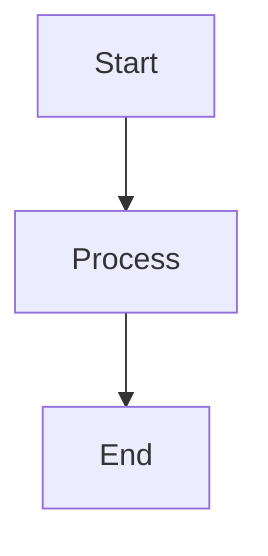

##  A lightweight blog built with modern web technologies

This blog system is built around several key architectural principles:

- **mono-jsx** architecture: Server-side JSX rendering without React overhead
- **HTMX** for interactivity: HTMX for dynamic interactions and progressive
  enhancement
- **Deno** for minimal dependencies: Leveraging Deno's standard library with
  minimal external dependencies
- Semantic **HTML**: Clean, accessible markup following modern best practices
- Pure **CSS**: Minimal, semantic, responsive styling without frameworks

## Features

- **Markdown Content**: Posts written in markdown with proper HTML rendering
- **Tag System**: Posts can be tagged and filtered by tag
- **Full-text Search**: Dual search experience with modal quick-search and full
  results page
- **Responsive Design**: Mobile-first styling that works seamlessly across all
  devices
- **Semantic Components**: Clean JSX components following semantic HTML and ARIA
  principles
- **Elegant Interactions**: Subtle hover effects and smooth animations
- **Mermaid Diagrams**: Support for Mermaid diagram rendering in posts
- **HTMX Navigation**: Smooth page transitions without full page reloads

## Architecture

The project follows a light functional programming style with TypeScript, and is
built using a mono-jsx architecture with clean separation of concerns and
semantic HTML/CSS. This modern approach creates a blog that's not just
functional, but showcases the future of web development—clean, fast, accessible,
and maintainable.

### Core Structure

```
├── src/
│   ├── app/
│   │   └── main.ts               # Main application entry point
│   ├── components/               # Reusable JSX components  
│   │   ├── About.tsx            # About page component
│   │   ├── Layout.tsx           # Main layout with HTML document generation
│   │   ├── NotFound.tsx         # 404 error page component
│   │   ├── PostList.tsx         # Blog post listing component
│   │   ├── PostView.tsx         # Individual post display with HTML rendering
│   │   ├── SearchResults.tsx    # Search results component
│   │   └── TagIndex.tsx         # Tag cloud component
│   ├── domain/                  # Business logic layer
│   │   ├── config.ts            # Typed configuration management
│   │   └── content.ts           # Content service with caching
│   ├── http/                    # HTTP transport layer
│   │   ├── middleware.ts        # HTTP middleware (logging, static files)
│   │   ├── router.ts            # Route handling utilities
│   │   ├── routes.tsx           # Route handlers and HTTP responses
│   │   ├── server.ts            # HTTP server setup
│   │   └── types.ts             # HTTP-related type definitions
│   ├── lib/                     # Core utilities and types
│   │   ├── error.ts             # Functional error handling
│   │   ├── result.ts            # Result monad implementation
│   │   └── types.ts             # Domain type definitions
│   ├── ports/                   # Infrastructure adapters
│   │   ├── cache.ts             # In-memory caching adapter
│   │   ├── clock.ts             # Time abstraction
│   │   ├── file-system.ts       # File system operations
│   │   └── logger.ts            # Logging abstraction
│   ├── utils/                   # Utility functions
│   │   ├── reading-time.ts      # Reading time calculation
│   │   └── seo-helpers.ts       # SEO metadata helpers
│   ├── markdown-renderer.tsx    # Markdown to HTML conversion
│   ├── mermaid-renderer.ts      # Mermaid diagram rendering
│   ├── metadata.ts              # SEO metadata generation
│   ├── og-image.ts              # Open Graph image generation
│   ├── rss.ts                   # RSS feed generation
│   ├── sitemap.ts               # XML sitemap generation
│   └── utils.ts                 # General utility functions
├── content/posts/               # Markdown blog posts
├── public/
│   ├── css/main.css            # Modern CSS with nesting, @scope, container queries
│   └── js/                     # HTMX and site JavaScript
└── CLAUDE.md                   # Development guidance and architecture notes
```

## Getting Started

### Prerequisites

- [Deno](https://deno.land/) v2.x or higher
- [mono-jsx](https://github.com/ije/mono-jsx/) v0.6.11 (automatically installed via npm)
- [HTMX](https://htmx.org/) v2.x (automatically downloaded via setup task)

### Installation

1. Clone the repository
2. Run the setup task to create the required directories and download HTMX:

```bash
deno task setup
```

### Development

Start the development server with hot reloading:

```bash
deno task dev
```

The blog will be available at `http://localhost:8000`

### Available Commands

- `deno task start` - Start the production server
- `deno task dev` - Start development server with watch mode and hot reloading
- `deno task test` - Run tests with no permissions
- `deno task test:watch` - Run tests in watch mode
- `deno task coverage` - Run tests with coverage report
- `deno task setup` - Initialize project structure and download dependencies
- `deno task check` - Type check the application
- `deno task fmt` - Format TypeScript/JSX files
- `deno task lint` - Lint source files

## Content Management

### Creating Posts

Create markdown files in `content/posts/` with YAML frontmatter:

````markdown
---
title: Your Post Title
date: 2025-01-15
slug: your-post-slug
excerpt: A brief description of your post
tags:
  - Technology
  - Tutorial
modified: 2025-01-16  # Optional: last modified date
---

# Your Post Content

Write your post content in markdown here. The blog automatically converts markdown to HTML and renders it properly using mono-jsx's `html()` function.

Supports:

- **Bold** and _italic_ text
- Code blocks with syntax highlighting
- Mermaid diagrams
- Links and images
- Lists and tables


````

### HTML Rendering

The blog uses mono-jsx's `html()` function to properly render markdown-converted HTML content:

```tsx
// In PostView component
import { html } from "mono-jsx/jsx-runtime";

export const PostView = ({ post }: { post: Post }) => {
  return (
    <div class="content">
      {html(post.content)} {/* Renders HTML properly */}
    </div>
  );
};
```

## Deployment

### Deno Deploy

The blog is optimized for deployment on [Deno Deploy](https://deno.com/deploy),
Deno's edge computing platform.

#### Quick Deployment

1. **Push to GitHub**: Ensure your blog is in a GitHub repository

2. **Connect to Deno Deploy**:
   - Visit [dash.deno.com](https://dash.deno.com)
   - Click "New Project"
   - Connect your GitHub repository
   - Set the entry point to `src/app/main.ts`

3. **Environment Configuration** (optional): Configure through environment variables:

   ```bash
   BLOG_TITLE=Your Blog Name
   BLOG_DESCRIPTION=Your blog description
   PUBLIC_URL=https://your-project.deno.dev
   ```

4. **Deploy**: On every push to `main`, Deno Deploy will automatically build and
   deploy your blog

#### Manual Deployment with CLI

```bash
# Install Deno Deploy CLI
deno install -A --global https://deno.land/x/deploy/deployctl.ts

# Deploy from local directory
deployctl deploy --project=your-project-name src/app/main.ts

# Deploy with environment variables
deployctl deploy --project=your-project-name --env=BLOG_TITLE="My Blog" src/app/main.ts
```

#### Deployment Configuration

The blog is configured for Deno Deploy in `deno.json`:

```json
{
  "tasks": {
    "start": "deno run --allow-net --allow-read --allow-env --allow-write src/app/main.ts",
    "dev": "deno run --allow-net --allow-read --allow-env --allow-write --watch src/app/main.ts"
  },
  "imports": {
    "mono-jsx": "npm:mono-jsx@0.6.11"
  },
  "deploy": {
    "exclude": ["**/node_modules", "coverage/", "tests/"],
    "include": [],
    "entrypoint": "src/app/main.ts"
  }
}
```

#### Production Features

- **Edge Computing**: Runs on Deno's global edge network
- **Automatic HTTPS**: SSL certificates automatically provisioned
- **Global CDN**: Static assets served from nearest edge location
- **Zero Configuration**: No build step required
- **Instant Deployments**: Changes are live in seconds
- **Automatic Scaling**: Handles traffic spikes without configuration

## UX/Design Philosophy

This blog showcases cutting-edge web development techniques that create a fast,
maintainable, and user-friendly experience:

### Semantic HTML First

The blog prioritizes semantic HTML structure over utility classes:

- Uses `<section>`, `<article>`, `<nav>` appropriately
- Leverages `role` attributes for accessibility
- Minimal CSS classes, maximum semantic meaning

### CSS Nesting

```css
/* Clean, organized CSS with native nesting */
nav {
  padding-block: 0.75rem;

  & ul {
    display: flex;
    gap: 0.5rem;

    & li {
      padding: 0.5rem;
    }
  }
}
```

### @scope for Component Isolation

```css
/* Scoped styles prevent CSS pollution */
@scope (ul[role="list"]) {
  :scope {
    list-style: none;
    display: flex;

    & li {
      padding: 0.1rem 0.35rem;
      border-radius: 3px;
    }
  }
}
```

### Container Queries

```css
/* Responsive design based on container size, not viewport */
@container (min-width: 48rem) {
  max-width: 42rem;
  padding: 1.5rem;
}
```

### CSS Logical Properties

```css
/* Internationalization-ready layout properties */
margin-block-end: 1.5rem; /* Instead of margin-bottom */
padding-inline-start: 0.75rem; /* Instead of padding-left */
border-block-start: 1px solid; /* Instead of border-top */
```

### Modern CSS Features

- `:where()` and `:is()` for better specificity control
- CSS custom properties (variables) for theming
- `clamp()` for fluid typography
- CSS Grid with `auto-fit` and `minmax()`
- Modern color functions and gradients

### ♿ Modern Accessibility Features

- ARIA roles and properties
- Proper heading hierarchy
- Touch-friendly targets (44px minimum)
- Keyboard navigation support
- Screen reader optimization

### Progressive Enhancement

- Works without JavaScript
- HTMX for smooth interactions
- Graceful degradation

### 🎯 User Experience Enhancements with View Transitions API

```css
/* Smooth page transitions (Chrome/Edge) */
@view-transition {
  navigation: auto;
}
```

### 📱 Mobile-First Container-Based Responsive Design

```css
/* Component-aware responsive design */
body {
  container-type: inline-size;
}

@container (min-width: 48rem) {
  /* Styles based on component width */
}
```

### CSS Variables for Theming

```css
:root {
  --color-syntax-keyword: #d73a49;
  --color-syntax-string: #032f62;
  --color-syntax-function: #6f42c1;
}

@media (prefers-color-scheme: dark) {
  :root {
    --color-syntax-keyword: #ff7b72;
    --color-syntax-string: #a5d6ff;
    --color-syntax-function: #d2a8ff;
  }
}
```

## Architecture Patterns

### Light Functional Programming

The codebase follows light FP patterns as documented in CLAUDE.md:

- **Result types** for error handling instead of exceptions
- **Pure functions** for business logic
- **Immutable data structures** with readonly types
- **Function composition** over inheritance
- **Dependency injection** through function parameters

### Clean Architecture

```
┌─────────────────────────────────────────────────────────┐
│                     HTTP Layer                          │
│  (routes.tsx, server.ts, middleware.ts)                │
└─────────────────────────────────────────────────────────┘
┌─────────────────────────────────────────────────────────┐
│                  Components Layer                       │
│     (Layout.tsx, PostView.tsx, PostList.tsx)           │
└─────────────────────────────────────────────────────────┘
┌─────────────────────────────────────────────────────────┐
│                   Domain Layer                          │
│        (content.ts, config.ts, types.ts)               │
└─────────────────────────────────────────────────────────┘
┌─────────────────────────────────────────────────────────┐
│                Infrastructure                           │
│     (file-system.ts, cache.ts, logger.ts)              │
└─────────────────────────────────────────────────────────┘
```

### HTML Rendering Solution

The blog properly renders markdown-converted HTML using mono-jsx:

```tsx
import { html } from "mono-jsx/jsx-runtime";

// ✅ Correct: renders HTML properly
{html(post.content)}

// ❌ Incorrect: would escape HTML
{html`${post.content}`}
```

## Performance

- **Server-side rendering** with mono-jsx
- **Intelligent caching** with TTL (5-minute default)
- **Minimal JavaScript payload** (only HTMX)
- **Progressive enhancement** with HTMX
- **Edge computing** on Deno Deploy
- **Static asset optimization** with proper caching headers

## Technology Stack

- **Runtime**: Deno v2.x
- **Rendering**: mono-jsx v0.6.11+ (server-side JSX without React)
- **Enhancement**: HTMX for dynamic interactions
- **Styling**: Modern CSS with nesting, @scope, container queries
- **Layout**: CSS logical properties and modern selectors
- **Content**: Markdown with YAML frontmatter
- **Diagrams**: @rendermaid/core for server-side Mermaid rendering
- **Search**: Client-side modal search with server-side filtering
- **Hosting**: Deno Deploy (edge computing platform)
- **Language**: TypeScript with strict type checking

## Development Guidelines

See `CLAUDE.md` for detailed development guidance including:
- Clean architecture patterns
- Light functional programming style
- Component organization
- Testing strategies
- TypeScript best practices

---

Built with ❤️ using modern web standards and the power of Deno + mono-jsx