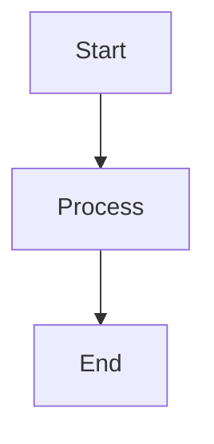

##  A lightweight blog built with modern web technologies

> **See it live:** [blogo.timok.com](https://blogo.timok.com/) - A production blog built entirely with Blogo.

This blog system is built around several key architectural principles:

- **hsx** architecture: Server-side JSX rendering without React overhead, using **HTMX** for dynamic interactions and progressive enhancement
- **Deno** for minimal dependencies: Leveraging Deno's standard library with minimal external dependencies
- Semantic **HTML**: Clean, accessible markup following modern best practices
- Pure **CSS**: Minimal, responsive styling without frameworks

## The Superstar Ingredient: hsx

**hsx** is a server-side JSX runtime that delivers the developer experience of React without the runtime cost. It transforms JSX into HTML strings at request time, producing zero JavaScript for the browser to parse.

### What Makes hsx Different

Traditional React sends a JavaScript bundle to the browser that reconstructs the DOM client-side. hsx takes a fundamentally different approach: JSX compiles to VNodes on the server, which render directly to HTML strings. The browser receives pure HTML, ready to display.

```tsx
// This JSX compiles to a VNode, not React.createElement
const PostCard = ({ title, excerpt }: { title: string; excerpt: string }) => (
  <article class="post-card">
    <h2>{title}</h2>
    <p>{excerpt}</p>
  </article>
);

// renderVNode() converts VNode tree to HTML string
const html = renderVNode(<PostCard title="Hello" excerpt="World" />);
// Result: <article class="post-card"><h2>Hello</h2><p>World</p></article>
```

### HTMX Integration

hsx provides semantic aliases for HTMX attributes, making dynamic behavior declarative in JSX:

```tsx
// Instead of writing hx-get, hx-target, hx-swap...
<a
  href="/posts"
  get="/posts"           // Maps to hx-get
  target="#content"      // Maps to hx-target
  swap="innerHTML"       // Maps to hx-swap
  pushUrl="true"         // Maps to hx-push-url
>
  Load Posts
</a>

// behavior="boost" enables hx-boost for progressive enhancement
<body behavior="boost">
  {/* All links and forms automatically use HTMX */}
</body>
```

### Raw HTML Injection

When rendering markdown or other pre-processed HTML, hsx provides a safe escape hatch:

```tsx
import { html } from "../http/render-vnode.ts";

// html() creates a raw HTML node that bypasses escaping
const PostContent = ({ content }: { content: string }) => (
  <section class="content">
    {html(content)}  {/* Renders HTML directly, not escaped */}
  </section>
);
```

### Why hsx Matters

1. **Zero client-side JavaScript** for rendering: The browser receives HTML, not instructions to build HTML
2. **Familiar DX**: Write JSX components exactly like React, but without useState, useEffect, or bundle complexity
3. **Server-side composition**: Components compose on the server where data lives
4. **HTMX synergy**: Semantic aliases make HTMX feel native to JSX
5. **Type safety**: Full TypeScript support with proper JSX types

The result is a blog that loads instantly, works without JavaScript, and progressively enhances with HTMX when available.

## Features

- **Markdown Content**: Posts written in markdown with proper HTML rendering and
  syntax highlighting
- **Tag System**: Posts can be tagged and filtered by tag
- **Full-text Search**: Dual search experience with modal quick-search and full
  results page
- **Light/Dark Theme Toggle**: Manual theme switcher with localStorage
  persistence
- **Responsive Design**: Mobile-optimized styling with optimal readability on
  all devices
- **Semantic Components**: Clean JSX components following semantic HTML and ARIA
  principles
- **Code Syntax Highlighting**: Highlight.js integration with Atom One Dark
  theme
- **Mermaid Diagrams**: Support for Mermaid diagram rendering in posts
- **HTMX Navigation**: Smooth page transitions without full page reloads

## Architecture

The project follows a light functional programming style with TypeScript, built on the hsx + HTMX architecture. Every page renders server-side through hsx components, while HTMX handles navigation and dynamic updates without full page reloads. This creates a blog that loads instantly, works without JavaScript, and feels like a SPA when JavaScript is available.

## Getting Started

### Prerequisites

- [Deno](https://deno.land/) v2.x or higher
- [hsx](https://github.com/srdjan/hsx) (JSR package @srdjan/hsx)
- [HTMX](https://htmx.org/) v2.x (automatically downloaded via setup task)

### Installation

1. Clone the repository
2. Run the setup task to create the required directories and download HTMX:

```bash
deno task setup
```

### Development

Start the development server with hot reloading:

```bash
deno task dev
```

The blog will be available at `http://localhost:8000`

### Available Commands

- `deno task start` - Start the production server
- `deno task dev` - Start development server with watch mode and hot reloading
- `deno task test` - Run tests with no permissions
- `deno task test:watch` - Run tests in watch mode
- `deno task coverage` - Run tests with coverage report
- `deno task setup` - Initialize project structure and download dependencies
- `deno task check` - Type check the application
- `deno task fmt` - Format TypeScript/JSX files
- `deno task lint` - Lint source files
- `deno task smoke` - Run the fast smoke-test suite used by the git hook
- `deno task hooks:install` - Point git at the bundled hook scripts

### Git Hooks & Smoke Tests

Run the following once per clone to enable the pre-commit hook that executes the
smoke test suite (`deno task smoke`) before every commit:

```bash
deno task hooks:install
```

If the smoke tests fail, the commit is aborted so you can address the issue
before pushing.

## Content Management

### Creating Posts

Create markdown files in `content/posts/` with YAML frontmatter:

````markdown
---
title: Your Post Title
date: 2025-01-15
tags: [Technology, Tutorial]
excerpt: A brief description of your post
modified: 2025-01-16 # Optional
---

# Your Post Content

Write your post content in markdown here. The blog automatically converts
markdown to HTML and renders it properly using the `html()` function.

Supports:

- **Bold** and _italic_ text
- Code blocks with syntax highlighting
- Mermaid diagrams
- Links and images
- Lists and tables


````

### HTML Rendering

The blog uses the `html()` function to properly render markdown-converted
HTML content:

```tsx
// In PostView component
import { html } from "../http/render-vnode.ts";

export const PostView = ({ post }: { post: Post }) => {
  return (
    <div class="content">
      {html(post.content)} {/* Renders HTML properly */}
    </div>
  );
};
```

## Deployment

### Deno Deploy

The blog is optimized for deployment on [Deno Deploy](https://deno.com/deploy),
Deno's edge computing platform.

#### Quick Deployment

1. **Push to GitHub**: Ensure your blog is in a GitHub repository

2. **Connect to Deno Deploy**:
   - Visit [dash.deno.com](https://dash.deno.com)
   - Click "New Project"
   - Connect your GitHub repository
   - Set the entry point to `src/app/main.ts`

3. **Environment Configuration** (optional): Configure through environment
   variables:

   ```bash
   BLOG_TITLE=Your Blog Name
   BLOG_DESCRIPTION=Your blog description
   PUBLIC_URL=https://your-project.deno.dev
   ```

4. **Deploy**: On every push to `main`, Deno Deploy will automatically build and
   deploy your blog

#### Manual Deployment with CLI

```bash
# Install Deno Deploy CLI
deno install -A --global https://deno.land/x/deploy/deployctl.ts

# Deploy from local directory
deployctl deploy --project=your-project-name src/app/main.ts

# Deploy with environment variables
deployctl deploy --project=your-project-name --env=BLOG_TITLE="My Blog" src/app/main.ts
```

#### Deployment Configuration

The blog is configured for Deno Deploy in `deno.json`:

```json
{
  "tasks": {
    "start": "deno run --allow-net --allow-read --allow-env --allow-write src/app/main.ts",
    "dev": "deno run --allow-net --allow-read --allow-env --allow-write --watch src/app/main.ts"
  },
  "imports": {
    "hsx/jsx-runtime": "jsr:@srdjan/hsx/jsx-runtime",
    "@srdjan/hsx": "jsr:@srdjan/hsx"
  },
  "deploy": {
    "exclude": ["**/node_modules", "coverage/", "tests/"],
    "include": [],
    "entrypoint": "src/app/main.ts"
  }
}
```

#### Production Features

- **Edge Computing**: Runs on Deno's global edge network
- **Automatic HTTPS**: SSL certificates automatically provisioned
- **Global CDN**: Static assets served from nearest edge location
- **Zero Configuration**: No build step required
- **Instant Deployments**: Changes are live in seconds
- **Automatic Scaling**: Handles traffic spikes without configuration

## UX/Design Philosophy

This blog showcases cutting-edge web development techniques that create a fast,
maintainable, and user-friendly experience:

### Semantic HTML First

The blog prioritizes semantic HTML structure over utility classes:

- Uses `<section>`, `<article>`, `<nav>` appropriately
- Leverages `role` attributes for accessibility
- Minimal CSS classes, maximum semantic meaning

### CSS Nesting

```css
/* Clean, organized CSS with native nesting */
nav {
  padding-block: 0.75rem;

  & ul {
    display: flex;
    gap: 0.5rem;

    & li {
      padding: 0.5rem;
    }
  }
}
```

### @scope for Component Isolation

```css
/* Scoped styles prevent CSS pollution */
@scope (ul[role="list"]) {
  :scope {
    list-style: none;
    display: flex;

    & li {
      padding: 0.1rem 0.35rem;
      border-radius: 3px;
    }
  }
}
```

### Container Queries

```css
/* Responsive design based on container size, not viewport */
@container (min-width: 48rem) {
  max-width: 42rem;
  padding: 1.5rem;
}
```

### CSS Logical Properties

```css
/* Internationalization-ready layout properties */
margin-block-end: 1.5rem; /* Instead of margin-bottom */
padding-inline-start: 0.75rem; /* Instead of padding-left */
border-block-start: 1px solid; /* Instead of border-top */
```

### Modern CSS Features

- `:where()` and `:is()` for better specificity control
- CSS custom properties (variables) for theming
- `clamp()` for fluid typography
- CSS Grid with `auto-fit` and `minmax()`
- Modern color functions and gradients

### Modern Accessibility Features

- ARIA roles and properties
- Proper heading hierarchy
- Touch-friendly targets (44px minimum)
- Keyboard navigation support
- Screen reader optimization

### Progressive Enhancement

- Works without JavaScript
- HTMX for smooth interactions
- Graceful degradation

### User Experience Enhancements with View Transitions API

```css
/* Smooth page transitions (Chrome/Edge) */
@view-transition {
  navigation: auto;
}
```

### Mobile-First Container-Based Responsive Design

```css
/* Component-aware responsive design */
body {
  container-type: inline-size;
}

@container (min-width: 48rem) {
  /* Styles based on component width */
}
```

### CSS Variables for Theming

```css
:root {
  --color-syntax-keyword: #d73a49;
  --color-syntax-string: #032f62;
  --color-syntax-function: #6f42c1;
}

@media (prefers-color-scheme: dark) {
  :root {
    --color-syntax-keyword: #ff7b72;
    --color-syntax-string: #a5d6ff;
    --color-syntax-function: #d2a8ff;
  }
}
```

## Architecture Patterns

### Light Functional Programming

The codebase follows light FP patterns as documented in CLAUDE.md:

- **Result types** for error handling instead of exceptions
- **Pure functions** for business logic
- **Immutable data structures** with readonly types
- **Function composition** over inheritance
- **Dependency injection** through function parameters

### Clean Architecture

```
┌─────────────────────────────────────────────────────────┐
│                     HTTP Layer                          │
│  (routes.tsx, server.ts, middleware.ts)                │
└─────────────────────────────────────────────────────────┘
┌─────────────────────────────────────────────────────────┐
│                  Components Layer                       │
│     (Layout.tsx, PostView.tsx, PostList.tsx)           │
└─────────────────────────────────────────────────────────┘
┌─────────────────────────────────────────────────────────┐
│                   Domain Layer                          │
│        (content.ts, config.ts, types.ts)               │
└─────────────────────────────────────────────────────────┘
┌─────────────────────────────────────────────────────────┐
│                Infrastructure                           │
│     (file-system.ts, cache.ts, logger.ts)              │
└─────────────────────────────────────────────────────────┘
```

### hsx Rendering Pipeline

The blog uses hsx's VNode-to-HTML pipeline. Components return VNodes (virtual DOM nodes), which `renderVNode()` recursively converts to HTML strings:

```tsx
// Component returns a VNode tree
const Page = () => (
  <Layout title="Home">
    <PostList posts={posts} />
  </Layout>
);

// renderVNode() walks the tree and produces HTML
const htmlString = renderVNode(<Page />);

// For raw HTML (markdown output), use html() to bypass escaping
import { html } from "../http/render-vnode.ts";

{html(post.content)}  // Renders as-is, not escaped
{post.content}        // Would escape HTML entities
```

## Performance

- **Server-side rendering** with hsx
- **Intelligent caching** with TTL (5-minute default)
- **Minimal JavaScript payload** (only HTMX)
- **Progressive enhancement** with HTMX
- **Edge computing** on Deno Deploy
- **Static asset optimization** with proper caching headers

## Technology Stack

- **Runtime**: Deno v2.x
- **Rendering**: [hsx](https://github.com/srdjan/hsx) (server-side JSX without React) - the core rendering engine that transforms JSX to HTML strings with zero client-side overhead
- **Interactivity**: HTMX v2.x for dynamic interactions via HTML attributes, seamlessly integrated through hsx semantic aliases
- **Styling**: Modern CSS with design tokens, responsive architecture, light/dark themes
- **Syntax Highlighting**: Highlight.js with Atom One Dark theme
- **Content**: Markdown with YAML frontmatter, parsed by marked
- **Diagrams**: @rendermaid/core for server-side Mermaid rendering
- **Search**: Client-side modal search with server-side filtering
- **Theme**: Manual light/dark toggle with localStorage persistence
- **Hosting**: Deno Deploy (edge computing platform)
- **Language**: TypeScript with strict type checking
- **Testing**: Deno's built-in testing framework with assertions from @std/testing/asserts

## Design System

### Color Architecture

- **Light theme**: Warm off-white backgrounds (#FEFDF8) with high-contrast text
- **Dark theme**: Warm dark grey (#1C1B18) to reduce eye strain
- **Accent**: Purple (#5B4FC6 / #9B8FE8) with WCAG AAA compliance
- **Semantic colors**: Visited links, code backgrounds, borders with subtle
  hierarchy

### Typography

- **Sans**: Montserrat (400, 600, 700)
- **Mono**: JetBrains Mono (400, 600)
- **Fluid scaling**: clamp() for responsive font sizes
- **Line height**: 1.75 for optimal readability

### Layout

- **Max width**: min(80vw, 72rem) - prevents excessive line length
- **Mobile**: Full-width cards with minimal padding
- **Desktop**: 95% width cards, centered in container
- **Spacing**: 4rem scale for consistent vertical rhythm

---

Built with hsx by Claude, GPT, and Srdjan.

**Try it yourself:** Fork the repo and deploy your own blog in minutes with Deno Deploy.

---

## License

MIT
