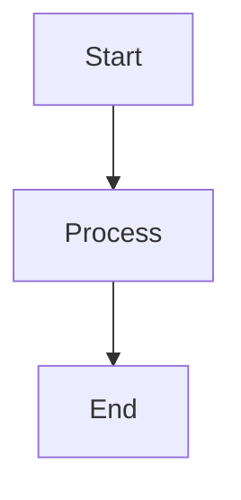

##  A lightweight blog built with modern web technologies

This blog system is built around several key architectural principles:

- **mono-jsx** architecture: Server-side JSX rendering without React overhead
- **HTMX** for interactivity: HTMX for dynamic interactions and progressive enhancement
- **Deno** for minimal dependencies: Leveraging Deno's standard library with minimal external dependencies
- Semantic **HTML**: Clean, accessible markup following modern best practices
- Pure **CSS**: Minimal, semantic, responsive styling without frameworks

## Features

- **Markdown Content**: Posts written in markdown
- **Tag System**: Posts can be tagged and filtered by a tag
- **Full-text Search**: Dual search experience with modal quick-search and full results page
- **Responsive Design**: Mobile-first styling that works seamlessly across all devices
- **Semantic Components**: Clean JSX components following semantic HTML and ARIA principles
- **Elegant Interactions**: Subtle hover effects and smooth animations
- **Mermaid Diagrams**: Support for Mermaid diagram rendering in posts
- **HTMX Navigation**: Smooth page transitions without full page reloads

## Architecture

The project follows a light functional programming style with TypeScript, and is 
built using a mono-jsx architecture with clean separation of concerns and semantic HTML/CSS.
This modern approach creates a blog that's not just functional, but showcases
the future of web development—clean, fast, accessible, and maintainable.

### Core Structure

```
├── app.tsx                    # Main application with serve wrapper and fetch handler
├── src/
│   ├── components/            # Semantic JSX components
│   │   ├── AboutHtml.tsx     # About page component
│   │   ├── NotFoundHtml.tsx  # 404 error page component
│   │   ├── PostListHtml.tsx  # Blog post listing component
│   │   ├── TagIndexHtml.tsx  # Tag cloud component
│   │   └── SearchResultsHtml.tsx # Search results component
│   ├── utils/
│   │   ├── content-loader.ts # Content loading and caching utilities
│   │   ├── layout-helpers.tsx # Main layout and HTML document generation
│   │   └── render-helpers.tsx # Component rendering utilities
│   ├── types.ts              # Type definitions with Result monad pattern
│   ├── config.ts             # Typed configuration management
│   ├── parser.ts             # Markdown parsing with frontmatter extraction
│   ├── error.ts              # Functional error handling
│   ├── utils.ts              # Utility functions (escaping, formatting)
│   ├── metadata.ts           # SEO metadata generation
│   └── markdown-renderer.tsx # Markdown to HTML rendering
├── content/posts/            # Markdown blog posts
├── public/
│   ├── css/main.css  # Modern CSS with nesting, @scope, container queries
│   └── js/                  # HTMX and site JavaScript
└── CLAUDE.md                # Development guidance and architecture notes
```

## Getting Started

### Prerequisites

- [mono-jsx](https://github.com/ije/mono-jsx/) v0.6.x or higher
- [Deno](https://deno.land/) v2.x or higher
- [HTMX](https://htmx.org/) v2.x or higher

### Installation

1. Clone the repository
2. Run the setup task to create the required directories and download HTMX:

```bash
deno task setup
```

### Development

Start the development server with hot reloading:

```bash
deno task dev
```

The blog will be available at `http://localhost:8000`

### Available Commands

- `deno task start` - Start the production server (`deno run` with required
  permissions)
- `deno task dev` - Start development server with watch mode and hot reloading
- `deno task setup` - Initialize project structure and download dependencies
- `deno fmt` - Format TypeScript/JSX files
- `deno lint` - Lint source files

## Content Management

### Creating Posts

Create markdown files in `content/posts/` with YAML frontmatter:

````markdown
---
title: Your Post Title
date: 2025-01-15
slug: your-post-slug
tags:
  - Technology
  - Tutorial
---

# Your Post Content

Write your post content in markdown here. Supports:

- **Bold** and _italic_ text
- Code blocks with syntax highlighting
- Mermaid diagrams
- Links and images
- Lists and tables


````

## Deployment

### Deno Deploy

The blog is optimized for deployment on [Deno Deploy](https://deno.com/deploy),
Deno's edge computing platform.

#### Quick Deployment with **DeployEA**

1. **Push to GitHub**: Ensure your blog is in a GitHub repository

2. **Connect to Deno Deploy**:
   - Visit [dash.deno.com](https://dash.deno.com)
   - Click "New Project"
   - Connect your GitHub repository
   - Set the entry point to `app.tsx`

3. **Environment Configuration** (optional):
   The blog can be configured through environment variables or by modifying`src/config.ts`:
   - Blog title and description
   - Posts per page
   - Cache TTL settings
   - Server configuration

   To set environment variables on Deno Deploy:
   - Go to your project dashboard on [dash.deno.com](https://dash.deno.com)
   - Click "Settings" → "Environment Variables"
   - Add your environment variables, e.g.:

      ```js
      BLOG_TITLE=Your Blog Name
      BLOG_DESCRIPTION=Your blog description
      PUBLIC_URL=https://your-project.deno.dev
      ```

4. **Deploy**:
   On every push to `main`, Deno Deploy will automatically build and deploy your blog

#### Manual Deployment with CLI

```bash
# Install Deno Deploy CLI
deno install -A --global https://deno.land/x/deploy/deployctl.ts

# Deploy from local directory
deployctl deploy --project=your-project-name app.tsx

# Deploy with environment variables
deployctl deploy --project=your-project-name --env=BLOG_TITLE="My Blog" app.tsx
```

#### Deployment Configuration

The blog is configured for Deno Deploy in `deno.json`:

```json
{
  "tasks": {
    "start": "deno run --allow-net --allow-read --allow-env --allow-write app.tsx",
    "dev": "deno run --allow-net --allow-read --allow-env --allow-write --watch app.tsx"
  },
  "imports": {
    "mono-jsx": "npm:mono-jsx@^0.6.6"
  },
  "deploy": {
    "exclude": ["**/node_modules"],
    "include": [],
    "entrypoint": "app.tsx"
  }
}
```

#### Custom Domain

To use a custom domain:

1. Go to your project dashboard on [dash.deno.com](https://dash.deno.com)
2. Click "Settings" → "Domains"
3. Add your custom domain
4. Update your DNS records as instructed
5. Update `PUBLIC_URL` environment variable if needed

#### Deployment Features

- **Edge Computing**: Your blog runs on Deno's global edge network
- **Automatic HTTPS**: SSL certificates are automatically provisioned
- **Global CDN**: Static assets are served from the nearest edge location
- **Zero Configuration**: No build step required, deploys directly from source
- **Instant Deployments**: Changes are live in seconds
- **Automatic Scaling**: Handles traffic spikes without configuration

#### Production Considerations

- **Content Updates**: Add new posts by committing markdown files to your
  repository and push to the main branch
- **Caching**: The blog includes intelligent caching for optimal performance
- **Static Assets**: CSS and JS are served efficiently from the edge
- **Environment Variables**: Configure blog settings through Deno Deploy
  dashboard

## UX/Design Philosophy

This blog showcases cutting-edge web development techniques that create a fast,
maintainable, and user-friendly experience:

### Semantic HTML First

The blog prioritizes semantic HTML structure over utility classes:

- Uses `<section>`, `<article>`, `<nav>` appropriately
- Leverages `role` attributes for accessibility
- Minimal CSS classes, maximum semantic meaning

### CSS Nesting

```css
/* Clean, organized CSS with native nesting */
nav {
  padding-block: 0.75rem;

  & ul {
    display: flex;
    gap: 0.5rem;

    & li {
      padding: 0.5rem;
    }
  }
}
```

### @scope for Component Isolation

```css
/* Scoped styles prevent CSS pollution */
@scope (ul[role="list"]) {
  :scope {
    list-style: none;
    display: flex;

    & li {
      padding: 0.1rem 0.35rem;
      border-radius: 3px;
    }
  }
}
```

### Container Queries

```css
/* Responsive design based on container size, not viewport */
@container (min-width: 48rem) {
  max-width: 42rem;
  padding: 1.5rem;
}
```

### CSS Logical Properties

```css
/* Internationalization-ready layout properties */
margin-block-end: 1.5rem; /* Instead of margin-bottom */
padding-inline-start: 0.75rem; /* Instead of padding-left */
border-block-start: 1px solid; /* Instead of border-top */
```

### Modern CSS Selectors & Features

- `:where()` and `:is()` for better specificity control
- CSS custom properties (variables) for theming
- `clamp()` for fluid typography
- CSS Grid with `auto-fit` and `minmax()`
- Modern color functions and gradients

### ♿ Modern Accessibility Features

- ARIA roles and properties
- Proper heading hierarchy
- Touch-friendly targets (44px minimum)
- Keyboard navigation support
- Screen reader optimization

### Progressive Enhancement

- Works without JavaScript
- HTMX for smooth interactions
- Graceful degradation

### 🎯 User Experience Enhancements with View Transitions API

```css
/* Smooth page transitions (Chrome/Edge) */
@view-transition {
  navigation: auto;
}
```

### 📱 Mobile-First Container-Based Responsive Design

```css
/* Component-aware responsive design */
body {
  container-type: inline-size;
}

@container (min-width: 48rem) {
  /* Styles based on component width */
}
```

### CSS Variables for Theming

```css
:root {
  --color-syntax-keyword: #d73a49;
  --color-syntax-string: #032f62;
  --color-syntax-function: #6f42c1;
}

@media (prefers-color-scheme: dark) {
  :root {
    --color-syntax-keyword: #ff7b72;
    --color-syntax-string: #a5d6ff;
    --color-syntax-function: #d2a8ff;
  }
}
```

## Performance

- Server-side rendering with mono-jsx
- Intelligent caching with TTL
- Minimal JavaScript payload
- Progressive enhancement with HTMX

## Technology Stack

- **Runtime**: Deno v2.x
- **Rendering**: mono-jsx v0.6.6+ (server-side JSX without React)
- **Enhancement**: HTMX for dynamic interactions and progressive enhancement
- **Styling**: Modern CSS with nesting, @scope, container queries
- **Layout**: CSS logical properties and modern selectors
- **Content**: Markdown documents
- **Diagrams**: Mermaid.js integration
- **Search**: Client-side modal search with minimal results display
- **Hosting**: Deno Deploy (edge computing platform)
- **Language**: TypeScript
