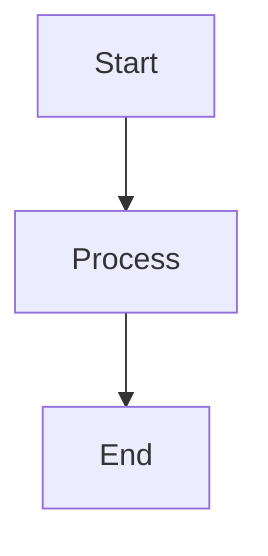

# Functional Minimal Blog

A lightweight, type-safe, functional blog implementation built with Deno,
TypeScript, mono-jsx, HTMX, and Markdown.

## Core Principles

This blog system is built around several key architectural principles:

1. **Functional Programming**: Pure functions, immutability, and type-safe data
   transformations
2. **Minimal Dependencies**: Leveraging Deno's standard library with minimal
   external dependencies
3. **Progressive Enhancement**: Core functionality works without JavaScript,
   enhanced with HTMX
4. **Type Safety**: Comprehensive type system for robust error handling
5. **Semantic HTML**: Clean, accessible markup following modern best practices
6. **Pure CSS**: Minimal, semantic, responsive styling without frameworks
7. **mono-jsx Architecture**: Server-side JSX rendering without React overhead

## Features

- **Markdown Content**: Posts written in markdown with YAML frontmatter
- **Tag System**: Posts can be tagged and filtered by tag with elegant tag cloud
  display
- **Full-text Search**: Client-side search implementation with modal interface
- **Responsive Design**: Mobile-first styling that works seamlessly across all
  devices
- **Semantic Components**: Clean JSX components following semantic HTML
  principles
- **Elegant Interactions**: Subtle hover effects and smooth animations
- **Mermaid Diagrams**: Support for Mermaid diagram rendering in posts
- **HTMX Navigation**: Smooth page transitions without full page reloads

## Architecture

The project follows a functional mono-jsx architecture with clean separation of
concerns and semantic HTML/CSS.

### Core Structure

```
├── app.tsx                    # Main mono-jsx application entry point
├── src/
│   ├── components/            # Semantic JSX components
│   │   ├── AboutHtml.tsx     # About page component
│   │   ├── NotFoundHtml.tsx  # 404 error page component
│   │   ├── PostListHtml.tsx  # Blog post listing component
│   │   ├── TagIndexHtml.tsx  # Tag cloud component
│   │   └── SearchResultsHtml.tsx # Search results component
│   ├── utils/
│   │   ├── content-loader.ts # Content loading and caching utilities
│   │   ├── layout-helpers.tsx # Main layout and HTML document generation
│   │   └── render-helpers.tsx # Component rendering utilities
│   ├── types.ts              # Type definitions with Result monad pattern
│   ├── config.ts             # Typed configuration management
│   ├── parser.ts             # Markdown parsing with frontmatter extraction
│   ├── error.ts              # Functional error handling
│   ├── utils.ts              # Utility functions (escaping, formatting)
│   ├── metadata.ts           # SEO metadata generation
│   └── markdown-renderer.tsx # Markdown to HTML rendering
├── content/posts/            # Markdown blog posts
├── public/
│   ├── css/main.css         # Semantic, responsive CSS
│   └── js/                  # HTMX and site JavaScript
└── CLAUDE.md                # Development guidance and architecture notes
```

## Getting Started

### Prerequisites

- [Deno](https://deno.land/) v2.x or higher

### Installation

1. Clone the repository
2. Run the setup task to create the required directories and download HTMX:

```bash
deno task setup
```

### Development

Start the development server with hot reloading:

```bash
deno task dev
```

Or start the production server:

```bash
deno task start
```

The blog will be available at `http://localhost:8000`

### Available Commands

- `deno task start` - Start the production server
- `deno task dev` - Start development server with watch mode
- `deno task setup` - Initialize project structure and download dependencies
- `deno fmt` - Format TypeScript/JSX files
- `deno lint` - Lint source files

## Content Management

### Creating Posts

Create markdown files in `content/posts/` with YAML frontmatter:

````markdown
---
title: Your Post Title
date: 2025-01-15
slug: your-post-slug
tags:
  - Technology
  - Tutorial
---

# Your Post Content

Write your post content in markdown here. Supports:

- **Bold** and _italic_ text
- Code blocks with syntax highlighting
- Mermaid diagrams
- Links and images
- Lists and tables


````

### Configuration

The blog can be configured through environment variables or by modifying
`src/config.ts`:

- Blog title and description
- Posts per page
- Cache TTL settings
- Server configuration

## Design Philosophy

### Semantic HTML First

The blog prioritizes semantic HTML structure over utility classes:

- Uses `<section>`, `<article>`, `<nav>` appropriately
- Leverages `role` attributes for accessibility
- Minimal CSS classes, maximum semantic meaning

### Responsive Design

CSS follows a mobile-first approach with:

- Fluid typography using `clamp()`
- CSS Grid for responsive layouts
- Touch-friendly navigation (44px minimum targets)
- Smooth transitions across all screen sizes

### Performance

- Server-side rendering with mono-jsx
- Intelligent caching with TTL
- Minimal JavaScript payload
- Progressive enhancement with HTMX

## Deployment

### Deno Deploy

The blog is optimized for deployment on [Deno Deploy](https://deno.com/deploy),
Deno's edge computing platform.

#### Quick Deployment

1. **Push to GitHub**: Ensure your blog is in a GitHub repository

2. **Connect to Deno Deploy**:
   - Visit [dash.deno.com](https://dash.deno.com)
   - Click "New Project"
   - Connect your GitHub repository
   - Set the entry point to `app.tsx`

3. **Environment Configuration** (optional):
   ```
   BLOG_TITLE=Your Blog Name
   BLOG_DESCRIPTION=Your blog description
   PUBLIC_URL=https://your-project.deno.dev
   ```

4. **Deploy**: Deno Deploy will automatically build and deploy your blog

#### Manual Deployment with CLI

```bash
# Install Deno Deploy CLI
deno install -A --global https://deno.land/x/deploy/deployctl.ts

# Deploy from local directory
deployctl deploy --project=your-project-name app.tsx

# Deploy with environment variables
deployctl deploy --project=your-project-name --env=BLOG_TITLE="My Blog" app.tsx
```

#### Deployment Configuration

The blog is configured for Deno Deploy in `deno.json`:

```json
{
  "deploy": {
    "exclude": ["**/node_modules"],
    "include": [],
    "entrypoint": "app.tsx"
  }
}
```

#### Custom Domain

To use a custom domain:

1. Go to your project dashboard on [dash.deno.com](https://dash.deno.com)
2. Click "Settings" → "Domains"
3. Add your custom domain
4. Update your DNS records as instructed
5. Update `PUBLIC_URL` environment variable if needed

#### Deployment Features

- **Edge Computing**: Your blog runs on Deno's global edge network
- **Automatic HTTPS**: SSL certificates are automatically provisioned
- **Global CDN**: Static assets are served from the nearest edge location
- **Zero Configuration**: No build step required, deploys directly from source
- **Instant Deployments**: Changes are live in seconds
- **Automatic Scaling**: Handles traffic spikes without configuration

#### Production Considerations

- **Content Updates**: Add new posts by committing markdown files to your
  repository
- **Caching**: The blog includes intelligent caching for optimal performance
- **Static Assets**: CSS and JS are served efficiently from the edge
- **Environment Variables**: Configure blog settings through Deno Deploy
  dashboard

## Technology Stack

- **Runtime**: Deno v2.x
- **Language**: TypeScript
- **Rendering**: mono-jsx (server-side JSX)
- **Enhancement**: HTMX for dynamic interactions
- **Styling**: Pure CSS with semantic approach
- **Content**: Markdown with YAML frontmatter
- **Diagrams**: Mermaid.js integration
- **Hosting**: Deno Deploy (edge computing platform)
