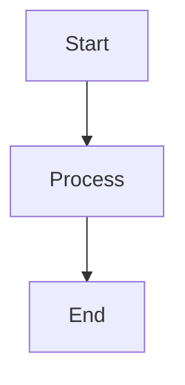

# Functional Minimal Blog

A lightweight, type-safe, functional blog implementation built with Deno,
TypeScript, mono-jsx, HTMX, and Markdown.

## Core Principles

This blog system is built around several key architectural principles:

1. **mono-jsx Architecture**: Server-side JSX rendering without React overhead
2. **HTMX for Interactivity**: HTMX for dynamic interactions and progressive
   enhancement
3. **Deno for Minimal Dependencies**: Leveraging Deno's standard library with minimal
   external dependencies
4. **Semantic HTML**: Clean, accessible markup following modern best practices
5. **Pure CSS**: Minimal, semantic, responsive styling without frameworks

## Features

- **Markdown Content**: Posts written in markdown
- **Tag System**: Posts can be tagged and filtered by a tag
- **Full-text Search**: Dual search experience with modal quick-search and full results page
- **Responsive Design**: Mobile-first styling that works seamlessly across all devices
- **Semantic Components**: Clean JSX components following semantic HTML and ARIA principles
- **Elegant Interactions**: Subtle hover effects and smooth animations
- **Mermaid Diagrams**: Support for Mermaid diagram rendering in posts
- **HTMX Navigation**: Smooth page transitions without full page reloads

## Architecture

The project follows a functional mono-jsx architecture with clean separation of
concerns and semantic HTML/CSS.

### Core Structure

```
├── app.tsx                    # Main application with serve wrapper and fetch handler
├── src/
│   ├── components/            # Semantic JSX components
│   │   ├── AboutHtml.tsx     # About page component
│   │   ├── NotFoundHtml.tsx  # 404 error page component
│   │   ├── PostListHtml.tsx  # Blog post listing component
│   │   ├── TagIndexHtml.tsx  # Tag cloud component
│   │   └── SearchResultsHtml.tsx # Search results component
│   ├── utils/
│   │   ├── content-loader.ts # Content loading and caching utilities
│   │   ├── layout-helpers.tsx # Main layout and HTML document generation
│   │   └── render-helpers.tsx # Component rendering utilities
│   ├── types.ts              # Type definitions with Result monad pattern
│   ├── config.ts             # Typed configuration management
│   ├── parser.ts             # Markdown parsing with frontmatter extraction
│   ├── error.ts              # Functional error handling
│   ├── utils.ts              # Utility functions (escaping, formatting)
│   ├── metadata.ts           # SEO metadata generation
│   └── markdown-renderer.tsx # Markdown to HTML rendering
├── content/posts/            # Markdown blog posts
├── public/
│   ├── css/main-modern.css  # Modern CSS with nesting, @scope, container queries
│   └── js/                  # HTMX and site JavaScript
└── CLAUDE.md                # Development guidance and architecture notes
```

## Getting Started

### Prerequisites

- [mono-jsx](https://github.com/ije/mono-jsx/) v0.6.x or higher 
- [Deno](https://deno.land/) v2.x or higher
- [HTMX](https://htmx.org/) for dynamic interactions

### Installation

1. Clone the repository
2. Run the setup task to create the required directories and download HTMX:

```bash
deno task setup
```

### Development

Start the development server with hot reloading:

```bash
deno task dev
```

Or start the production server:

```bash
deno task start
```

The blog will be available at `http://localhost:8000`

### Available Commands

- `deno task start` - Start the production server (`deno run` with required permissions)
- `deno task dev` - Start development server with watch mode and hot reloading
- `deno task setup` - Initialize project structure and download dependencies
- `deno fmt` - Format TypeScript/JSX files
- `deno lint` - Lint source files

## Content Management

### Creating Posts

Create markdown files in `content/posts/` with YAML frontmatter:

````markdown
---
title: Your Post Title
date: 2025-01-15
slug: your-post-slug
tags:
  - Technology
  - Tutorial
---

# Your Post Content

Write your post content in markdown here. Supports:

- **Bold** and _italic_ text
- Code blocks with syntax highlighting
- Mermaid diagrams
- Links and images
- Lists and tables


````

### Configuration

The blog can be configured through environment variables or by modifying
`src/config.ts`:

- Blog title and description
- Posts per page
- Cache TTL settings
- Server configuration

## Design Philosophy

### Semantic HTML First

The blog prioritizes semantic HTML structure over utility classes:

- Uses `<section>`, `<article>`, `<nav>` appropriately
- Leverages `role` attributes for accessibility
- Minimal CSS classes, maximum semantic meaning

### Responsive Design

CSS follows a mobile-first approach with:

- Fluid typography using `clamp()`
- CSS Grid for responsive layouts
- Touch-friendly navigation (44px minimum targets)
- Smooth transitions across all screen sizes

### Performance

- Server-side rendering with mono-jsx
- Intelligent caching with TTL
- Minimal JavaScript payload
- Progressive enhancement with HTMX

## Deployment

### Deno Deploy

The blog is optimized for deployment on [Deno Deploy](https://deno.com/deploy),
Deno's edge computing platform.

#### Quick Deployment

1. **Push to GitHub**: Ensure your blog is in a GitHub repository

2. **Connect to Deno Deploy**:
   - Visit [dash.deno.com](https://dash.deno.com)
   - Click "New Project"
   - Connect your GitHub repository
   - Set the entry point to `app.tsx`

3. **Environment Configuration** (optional):
   ```
   BLOG_TITLE=Your Blog Name
   BLOG_DESCRIPTION=Your blog description
   PUBLIC_URL=https://your-project.deno.dev
   ```

4. **Deploy**: Deno Deploy will automatically build and deploy your blog

#### Manual Deployment with CLI

```bash
# Install Deno Deploy CLI
deno install -A --global https://deno.land/x/deploy/deployctl.ts

# Deploy from local directory
deployctl deploy --project=your-project-name app.tsx

# Deploy with environment variables
deployctl deploy --project=your-project-name --env=BLOG_TITLE="My Blog" app.tsx
```

#### Deployment Configuration

The blog is configured for Deno Deploy in `deno.json`:

```json
{
  "tasks": {
    "start": "deno run --allow-net --allow-read --allow-env --allow-write app.tsx",
    "dev": "deno run --allow-net --allow-read --allow-env --allow-write --watch app.tsx"
  },
  "imports": {
    "mono-jsx": "npm:mono-jsx@^0.6.6"
  },
  "deploy": {
    "exclude": ["**/node_modules"],
    "include": [],
    "entrypoint": "app.tsx"
  }
}
```

#### Custom Domain

To use a custom domain:

1. Go to your project dashboard on [dash.deno.com](https://dash.deno.com)
2. Click "Settings" → "Domains"
3. Add your custom domain
4. Update your DNS records as instructed
5. Update `PUBLIC_URL` environment variable if needed

#### Deployment Features

- **Edge Computing**: Your blog runs on Deno's global edge network
- **Automatic HTTPS**: SSL certificates are automatically provisioned
- **Global CDN**: Static assets are served from the nearest edge location
- **Zero Configuration**: No build step required, deploys directly from source
- **Instant Deployments**: Changes are live in seconds
- **Automatic Scaling**: Handles traffic spikes without configuration

#### Production Considerations

- **Content Updates**: Add new posts by committing markdown files to your
  repository
- **Caching**: The blog includes intelligent caching for optimal performance
- **Static Assets**: CSS and JS are served efficiently from the edge
- **Environment Variables**: Configure blog settings through Deno Deploy
  dashboard

## Modern Web Techniques & Features

This blog showcases cutting-edge web development techniques that create a fast,
maintainable, and user-friendly experience.

### 🎨 **Modern CSS Architecture**

#### **CSS Nesting**

```css
/* Clean, organized CSS with native nesting */
nav {
  padding-block: 0.75rem;

  & ul {
    display: flex;
    gap: 0.5rem;

    & li {
      padding: 0.5rem;
    }
  }
}
```

#### **@scope for Component Isolation**

```css
/* Scoped styles prevent CSS pollution */
@scope (ul[role="list"]) {
  :scope {
    list-style: none;
    display: flex;

    & li {
      padding: 0.1rem 0.35rem;
      border-radius: 3px;
    }
  }
}
```

#### **Container Queries**

```css
/* Responsive design based on container size, not viewport */
@container (min-width: 48rem) {
  max-width: 42rem;
  padding: 1.5rem;
}
```

#### **CSS Logical Properties**

```css
/* Internationalization-ready layout properties */
margin-block-end: 1.5rem; /* Instead of margin-bottom */
padding-inline-start: 0.75rem; /* Instead of padding-left */
border-block-start: 1px solid; /* Instead of border-top */
```

#### **Modern CSS Selectors & Features**

- `:where()` and `:is()` for better specificity control
- CSS custom properties (variables) for theming
- `clamp()` for fluid typography
- CSS Grid with `auto-fit` and `minmax()`
- Modern color functions and gradients

### 🚀 **Performance Optimizations**

#### **Size Reduction**

- **67% smaller CSS** (1200+ lines → 400 lines) through nesting
- **Semantic HTML** reduces class pollution
- **Component-scoped styles** eliminate unused CSS

#### **Modern Font Stacks**

```css
/* System fonts for optimal performance */
font-family: system-ui, -apple-system, sans-serif;
font-family: ui-monospace, "SF Mono", "Monaco", monospace;
```

#### **Intelligent Caching**

- TTL-based content caching
- Static asset optimization
- Edge-ready deployment

### ♿ **Accessibility & UX**

#### **Semantic HTML Structure**

```tsx
// Meaningful markup over utility classes
<article>
  <header>
    <h2>
      <a href="/post">Title</a>
    </h2>
    <time dateTime="2025-01-15">Jan 15, 2025</time>
  </header>
  <summary>Post excerpt...</summary>
</article>;
```

#### **Modern Accessibility Features**

- ARIA roles and properties
- Proper heading hierarchy
- Touch-friendly targets (44px minimum)
- Keyboard navigation support
- Screen reader optimization

#### **Progressive Enhancement**

- Works without JavaScript
- HTMX for smooth interactions
- Graceful degradation

### 🎯 **User Experience Enhancements**

#### **View Transitions API**

```css
/* Smooth page transitions (Chrome/Edge) */
@view-transition {
  navigation: auto;
}
```

#### **Preference-Based Design**

```css
/* Respects user system preferences */
@media (prefers-reduced-motion: reduce) {
  * {
    animation-duration: 0.01ms !important;
  }
}

@media (prefers-contrast: high) {
  /* Enhanced contrast for accessibility */
}

@media (prefers-color-scheme: dark) {
  /* Automatic dark mode */
}
```

#### **Micro-Interactions**

- Subtle hover effects with transforms
- Smooth transitions and animations
- Progressive disclosure patterns
- Visual feedback for interactions

#### **Enhanced Search Experience**

- **Modal Search**: Quick access with title-only results for fast browsing
- **Full Search Page**: Complete results with excerpts, dates, and metadata
- **Event Delegation**: Robust JavaScript that persists through HTMX navigation
- **Dialog API**: Native browser modal functionality with proper focus management

### **Clean Server Architecture**

```typescript
// Custom serve wrapper for better control
export const serve = (
  fetchHandler: (request: Request) => Response | Promise<Response>,
  options: ServeOptions = {}
): Deno.HttpServer => {
  const { port = 8000, hostname = "localhost", signal } = options;
  return Deno.serve({ port, hostname, signal }, fetchHandler);
};
```

- **Separation of Concerns**: App logic separate from server startup
- **Testable Architecture**: Fetch handler can be tested independently  
- **Environment Detection**: `import.meta.main` for conditional server start
- **Flexible Configuration**: Configurable port, hostname, and abort signals

### 🎨 **Visual Design System**

#### **Striking Code Highlighting**

- GitHub-inspired color scheme
- Enhanced contrast and readability
- Language-specific styling
- Dark mode optimization

#### **Tag System Evolution**

- Content-proportional widths
- Semantic `ul[role="list"]` structure
- Consistent styling across contexts
- Hover states and transitions

#### **Typography & Layout**

- Fluid typography with `clamp()`
- Optimal line heights (1.6-1.7)
- Semantic spacing rhythm
- Visual hierarchy through color and weight

### 📱 **Mobile-First Responsive Design**

#### **Container-Based Responsiveness**

```css
/* Component-aware responsive design */
body {
  container-type: inline-size;
}

@container (min-width: 48rem) {
  /* Styles based on component width */
}
```

#### **Touch-Optimized Interactions**

- 44px minimum touch targets
- Optimized spacing for mobile
- Gesture-friendly navigation
- Fast tap responses

### 🌙 **Advanced Theming**

#### **CSS Variables for Theming**

```css
:root {
  --color-syntax-keyword: #d73a49;
  --color-syntax-string: #032f62;
  --color-syntax-function: #6f42c1;
}

@media (prefers-color-scheme: dark) {
  :root {
    --color-syntax-keyword: #ff7b72;
    --color-syntax-string: #a5d6ff;
    --color-syntax-function: #d2a8ff;
  }
}
```

#### **Automatic Dark Mode**

- System preference detection
- Smooth color transitions
- Optimized contrast ratios
- Consistent theming across components

### 📊 **Modern Architecture Benefits**

1. **Maintainability**: CSS nesting and scoping reduce complexity
2. **Performance**: Smaller CSS bundle, faster loading
3. **Scalability**: Component-based architecture
4. **Accessibility**: Semantic HTML and ARIA support
5. **Future-Proof**: Uses latest web standards
6. **Developer Experience**: Better debugging and organization
7. **User Experience**: Smooth interactions and responsive design

### 🎯 **Key Principles**

- **Zero-Class Components**: Most styling through element selectors
- **Content-Aware Design**: Tags scale to content size
- **Progressive CSS**: Modern features with fallbacks
- **Semantic-First**: Meaning over appearance
- **Performance-Optimized**: Every technique chosen for speed
- **Accessibility-Native**: Built-in, not bolted-on

This modern approach creates a blog that's not just functional, but showcases
the future of web development—clean, fast, accessible, and maintainable.

## Technology Stack

- **Runtime**: Deno v2.x
- **Rendering**: mono-jsx v0.6.6+ (server-side JSX without React)
- **Enhancement**: HTMX for dynamic interactions and progressive enhancement
- **Styling**: Modern CSS with nesting, @scope, container queries
- **Layout**: CSS logical properties and modern selectors
- **Content**: Markdown with YAML frontmatter
- **Diagrams**: Mermaid.js integration
- **Search**: Client-side modal search with minimal results display
- **Hosting**: Deno Deploy (edge computing platform)
- **Language**: TypeScript
