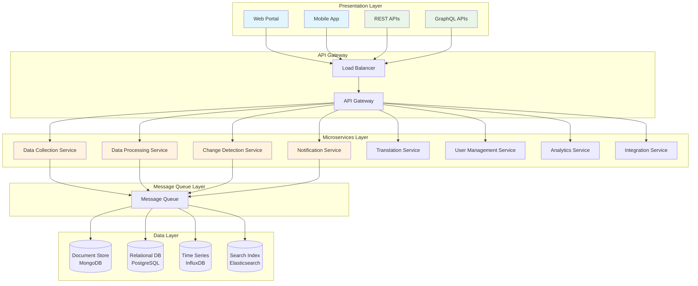
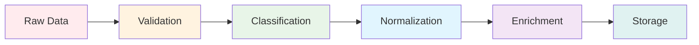
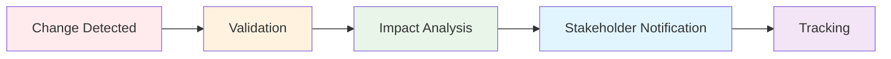

## Executive Summary

The WTO Trade Compliance Monitoring System is a cloud-native, globally distributed platform designed to collect, process, and distribute regulatory trade compliance updates from all 164 WTO member countries in real-time. This comprehensive system provides automated monitoring, intelligent change detection, multi-language support, and comprehensive API integration capabilities.

**Key Objectives:**

- Monitor regulatory changes across 164 WTO member countries
- Process and standardize diverse regulatory data formats
- Provide real-time notifications and updates
- Support multiple languages and legal frameworks
- Enable seamless third-party integrations

## The Challenge

Global trade compliance presents unique challenges in today's interconnected economy. With 164 WTO member countries, each maintaining their own regulatory frameworks, languages, and legal systems, staying current with trade compliance requirements is a monumental task. Traditional approaches to monitoring regulatory changes are manual, time-consuming, and prone to critical oversights that can result in significant compliance violations and financial penalties.

## High-Level System Architecture

### Architecture Overview

The system follows a modern microservices architecture with clear separation of concerns across multiple layers:



### Cloud Infrastructure

**Multi-Region Deployment Strategy:**

- **Primary regions**: North America (AWS us-east-1), Europe (AWS eu-west-1), Asia-Pacific (AWS ap-southeast-1)
- **Secondary regions**: Disaster recovery and regional compliance
- **Edge locations**: Content delivery and reduced latency

## Detailed Component Design

### Data Collection Layer

The data collection layer forms the foundation of our monitoring system, responsible for gathering regulatory information from diverse sources across all WTO member countries.

#### Source Monitoring Components

**Web Scraping Engine:**

```yaml
Components:
  - Distributed Crawler Network
  - Source Configuration Manager
  - Content Extraction Engine
  - Rate Limiting & Politeness Manager
  - Proxy Rotation System
```

**API Integration Hub:**

```yaml
Components:
  - Government API Connectors
  - Trade Ministry Interfaces
  - Customs Authority Integrations
  - International Organization Feeds
  - Third-party Data Provider APIs
```

**Document Processing Pipeline:**

```yaml
Components:
  - PDF/DOC Text Extraction
  - OCR for Scanned Documents
  - Structured Data Parsers
  - Metadata Extraction Engine
  - Format Normalization
```

#### Source Coverage Strategy

**Tiered Monitoring Approach:**

- **Tier 1 Countries** (G20): Real-time monitoring with <15min latency
- **Tier 2 Countries** (Major trading partners): Hourly monitoring
- **Tier 3 Countries** (Remaining WTO members): Daily monitoring
- **Emergency Escalation**: Immediate monitoring for critical changes

### Data Processing Pipeline

#### Real-Time Processing Architecture

The data processing pipeline transforms raw regulatory data into structured, actionable intelligence:



**Processing Components:**

1. **Data Validation Service:**
   - Schema validation and integrity checks
   - Data quality assessment and scoring
   - Duplicate detection and deduplication
   - Source verification and authenticity

2. **Classification Engine:**
   - Regulatory category identification using ML
   - Industry impact analysis and mapping
   - Compliance requirement extraction
   - Implementation timeline detection

3. **Normalization Service:**
   - Standard format conversion across sources
   - Harmonized System (HS) code mapping
   - Currency standardization and conversion
   - Date/time normalization across timezones

4. **Enrichment Engine:**
   - Historical context and precedent addition
   - Related regulation linking and cross-referencing
   - Impact assessment scoring and prioritization
   - Stakeholder identification and notification

#### Machine Learning Pipeline

**ML Components:**

```yaml
ML Models:
  - Document Classification Models
  - Named Entity Recognition (NER)
  - Sentiment Analysis for Impact Assessment
  - Similarity Detection Algorithms
  - Trend Prediction Models
```

### 2.3 Change Detection System

#### 2.3.1 Intelligent Change Detection

**Detection Algorithms:**

1. **Content Comparison Engine:**
   - Semantic similarity analysis
   - Structural change detection
   - Numerical value change tracking
   - Date/deadline modifications

2. **Impact Classification:**
   - **Critical**: Immediate compliance requirements
   - **High**: Significant operational impact
   - **Medium**: Moderate business implications
   - **Low**: Minor procedural changes

3. **Priority Scoring Matrix:**

   ```javascript
   Priority = (Impact Score × Urgency Factor × Coverage Scope) / Time to Implementation
   ```

#### Change Management Workflow



### Multi-Language Support System

#### Translation Architecture

**Translation Pipeline:**

```yaml
Translation Components:
  - Language Detection Service
  - Machine Translation Engine (GPT-4, Google Translate API)
  - Human Translation Queue
  - Quality Assurance System
  - Terminology Management
```

**Supported Languages:**

- All 6 UN official languages (English, Spanish, French, Arabic, Chinese, Russian)
- 20+ major trade languages
- Regional language support for specific markets

#### 2.4.2 Legal Framework Adaptation

**Localization Components:**

- Legal system classification
- Jurisdiction-specific interpretation
- Local compliance requirement mapping
- Cultural context adaptation

### 2.5 API and Integration Layer

#### 2.5.1 RESTful API Design

**API Endpoints:**

```http
GET    /api/v1/regulations           # List regulations
GET    /api/v1/regulations/{id}      # Get specific regulation
GET    /api/v1/changes               # List recent changes
POST   /api/v1/subscriptions         # Create subscription
GET    /api/v1/countries/{code}      # Country-specific data
GET    /api/v1/sectors/{sector}      # Sector-specific regulations
```

**GraphQL Schema:**

```graphql
type Regulation {
  id: ID!
  country: Country!
  title: String!
  description: String!
  category: RegulationCategory!
  effectiveDate: DateTime!
  changes: [Change!]!
  impact: ImpactAssessment!
}
```

#### 2.5.2 Webhook System

**Webhook Features:**

- Real-time change notifications
- Configurable trigger conditions
- Retry mechanisms with exponential backoff
- Payload signing for security
- Rate limiting protection

---

## 3. Data Models

### 3.1 Core Data Entities

#### 3.1.1 Regulation Entity

```json
{
  "id": "string",
  "country_code": "string",
  "source_agency": "string",
  "title": "string",
  "description": "string",
  "category": "enum",
  "subcategory": "string",
  "hs_codes": ["string"],
  "effective_date": "datetime",
  "expiration_date": "datetime",
  "implementation_timeline": "object",
  "impact_assessment": "object",
  "related_regulations": ["string"],
  "original_language": "string",
  "translations": "object",
  "source_url": "string",
  "document_hash": "string",
  "version": "integer",
  "created_at": "datetime",
  "updated_at": "datetime"
}
```

#### 3.1.2 Change Entity

```json
{
  "id": "string",
  "regulation_id": "string",
  "change_type": "enum",
  "priority": "enum",
  "impact_score": "float",
  "summary": "string",
  "detailed_changes": "object",
  "affected_industries": ["string"],
  "implementation_date": "datetime",
  "stakeholders": ["string"],
  "detected_at": "datetime",
  "verified_at": "datetime",
  "notification_sent": "boolean"
}
```

### 3.2 Database Design

#### 3.2.1 PostgreSQL Schema

- **Primary database** for structured data, relationships, and ACID transactions
- **Tables**: countries, agencies, regulations, changes, users, subscriptions
- **Indexing strategy** for optimized query performance

#### 3.2.2 MongoDB Collections

- **Document storage** for unstructured regulatory documents
- **Collections**: raw_documents, processed_content, translations
- **Sharding strategy** by country and date for scalability

#### 3.2.3 Elasticsearch Indices

- **Full-text search** capabilities
- **Indices**: regulations_search, changes_search, documents_search
- **Synonym handling** and multilingual search support

---

## 4. Technology Stack Recommendations

### 4.1 Infrastructure Layer

- **Cloud Provider**: AWS (primary), Azure (secondary)
- **Container Orchestration**: Amazon EKS (Kubernetes)
- **Service Mesh**: Istio for microservices communication
- **Infrastructure as Code**: Terraform
- **CI/CD**: GitHub Actions, AWS CodePipeline

### 4.2 Application Layer

- **Backend Framework**: Node.js (Express), Python (FastAPI)
- **API Gateway**: AWS API Gateway + Kong
- **Message Queue**: Apache Kafka, AWS SQS
- **Caching**: Redis, AWS ElastiCache
- **Search Engine**: Elasticsearch

### 4.3 Data Layer

- **Primary Database**: PostgreSQL (AWS RDS)
- **Document Store**: MongoDB Atlas
- **Time Series**: InfluxDB
- **Data Warehouse**: AWS Redshift
- **File Storage**: AWS S3

### 4.4 Monitoring & Security

- **Monitoring**: Prometheus, Grafana, AWS CloudWatch
- **Logging**: ELK Stack (Elasticsearch, Logstash, Kibana)
- **Security**: AWS WAF, HashiCorp Vault
- **Identity Management**: AWS Cognito, Auth0

---

## 5. Implementation Phases

### Phase 1: Foundation (Months 1-6)

#### Core Infrastructure Setup

- Cloud infrastructure provisioning
- Basic microservices architecture
- Primary database setup
- Initial API framework
- Security and authentication systems

#### Phase 1 Deliverables

- MVP system architecture
- Core APIs operational
- Initial data collection for 10 major countries
- Basic web interface

### Phase 2: Scale & Intelligence (Months 7-12)

#### Advanced Features Development

- Machine learning pipeline implementation
- Change detection algorithms
- Multi-language translation system
- Advanced search capabilities
- Webhook notification system

#### Phase 2 Deliverables

- Full change detection system
- ML-powered classification
- Coverage expanded to 50 countries
- Advanced API features
- Mobile application

### Phase 3: Global Expansion (Months 13-18)

#### Comprehensive Coverage

- Complete WTO member country coverage
- Advanced analytics and reporting
- Enterprise integration capabilities
- Performance optimization
- Compliance and certification

#### Phase 3 Deliverables

- All 164 WTO countries covered
- Enterprise-grade SLA compliance
- Advanced analytics dashboard
- Third-party integrations
- Full compliance certification

### Phase 4: Innovation & Optimization (Months 19-24)

#### Advanced Capabilities

- Predictive analytics
- AI-powered impact assessment
- Advanced workflow automation
- Custom compliance frameworks
- Industry-specific solutions

#### Phase 4 Deliverables

- Predictive compliance insights
- Advanced AI capabilities
- Industry-specific modules
- Custom enterprise solutions
- Global expansion complete

---

## 6. Cost Estimation

### 6.1 Infrastructure Costs (Annual)

**Cloud Infrastructure:**

- **Compute Resources**: $480,000/year
  - EKS clusters across 3 regions
  - Auto-scaling EC2 instances
  - Load balancers and networking

- **Storage & Databases**: $240,000/year
  - RDS PostgreSQL multi-AZ
  - MongoDB Atlas clusters
  - S3 storage for documents
  - Elasticsearch clusters

- **Networking & CDN**: $120,000/year
  - CloudFront distribution
  - VPC networking
  - Inter-region data transfer

### 6.2 Development & Operations

**Development Team (24 months):**

- **Technical Leadership**: $1,200,000
  - Solution Architect: $200k × 2
  - Technical Lead: $180k × 2
  - DevOps Engineer: $160k × 2
  - Security Engineer: $170k × 2

- **Development Team**: $2,880,000
  - Senior Backend Engineers: $150k × 8
  - Frontend Engineers: $140k × 4
  - ML Engineers: $160k × 4
  - QA Engineers: $120k × 4

- **Operations & Support**: $720,000
  - Site Reliability Engineers: $150k × 2
  - Support Engineers: $100k × 4
  - Data Engineers: $140k × 2

### 6.3 Third-Party Services

**Annual Service Costs:**

- **Translation Services**: $150,000/year
- **Legal & Compliance Consulting**: $200,000/year
- **Security & Penetration Testing**: $100,000/year
- **Monitoring & Alerting Tools**: $50,000/year
- **ML/AI Service APIs**: $180,000/year

### 6.4 Total Cost Summary

**24-Month Development Period:**

- **Infrastructure**: $1,680,000
- **Personnel**: $4,800,000
- **Third-party Services**: $1,360,000
- **Contingency (15%)**: $1,176,000

**Total Investment**: $9,016,000

**Annual Operating Costs (Post-Launch):**

- **Infrastructure**: $840,000
- **Operations Team**: $1,200,000
- **Third-party Services**: $680,000
- **Maintenance & Updates**: $400,000

**Annual Operating Total**: $3,120,000

---

## 7. Success Metrics & KPIs

### 7.1 Coverage Metrics

- **Country Coverage**: 164/164 WTO member countries (100%)
- **Source Coverage**: >500 official government sources
- **Language Coverage**: 25+ languages supported
- **Update Frequency**: <1 hour for critical changes

### 7.2 Performance Metrics

- **System Uptime**: 99.9% availability
- **API Response Time**: <200ms average
- **Data Processing Latency**: <15 minutes end-to-end
- **Search Response Time**: <100ms

### 7.3 Data Quality Metrics

- **Data Accuracy**: >95% accuracy rate
- **Completeness**: >90% complete regulatory data
- **Duplicate Detection**: <1% duplicate content
- **Translation Quality**: >85% human evaluation score

### 7.4 User Adoption Metrics

- **API Usage**: 10M+ API calls/month
- **Active Users**: 10,000+ monthly active users
- **Enterprise Customers**: 500+ enterprise subscriptions
- **User Satisfaction**: >4.5/5 customer satisfaction score

### 7.5 Business Impact Metrics

- **Compliance Risk Reduction**: 60% reduction in compliance violations
- **Time to Awareness**: 80% faster regulatory change awareness
- **Cost Savings**: $10M+ annual savings across customer base
- **Market Coverage**: 80% of global trade volume covered

---

## 8. Risk Management & Mitigation

### 8.1 Technical Risks

- **Data Source Reliability**: Multiple source validation, fallback mechanisms
- **Scalability Challenges**: Auto-scaling, load testing, performance monitoring
- **Security Vulnerabilities**: Regular security audits, penetration testing
- **Translation Accuracy**: Human validation, quality assurance processes

### 8.2 Operational Risks

- **Regulatory Compliance**: Legal review, compliance frameworks
- **Data Privacy**: GDPR compliance, data localization
- **Service Dependencies**: Multi-vendor strategy, service redundancy
- **Key Personnel**: Knowledge documentation, cross-training

### 8.3 Business Risks

- **Market Competition**: Continuous innovation, unique value proposition
- **Customer Adoption**: User experience focus, comprehensive support
- **Revenue Model**: Multiple revenue streams, flexible pricing
- **Partnership Dependencies**: Diversified partnership strategy

---

## 9. Conclusion

The WTO Trade Compliance Monitoring System represents a comprehensive solution for global trade regulatory monitoring. The proposed architecture provides:

- **Scalable and resilient infrastructure** capable of handling global data volumes
- **Intelligent processing capabilities** for automated change detection and classification
- **Comprehensive integration options** for enterprise customers
- **Multi-language support** for global accessibility
- **Real-time notification systems** for time-critical updates

The system is designed to evolve with changing requirements and scale to meet growing demand while maintaining high standards of accuracy, security, and performance.

**Success Factors:**

1. Strong technical leadership and experienced development team
2. Robust infrastructure and security practices
3. Comprehensive testing and quality assurance
4. Strategic partnerships with government agencies and trade organizations
5. Continuous improvement based on user feedback and market needs

The estimated investment of $9.0M over 24 months positions this system as a market-leading solution for global trade compliance monitoring, with significant potential for positive ROI through improved compliance efficiency and reduced regulatory risks for customers.
