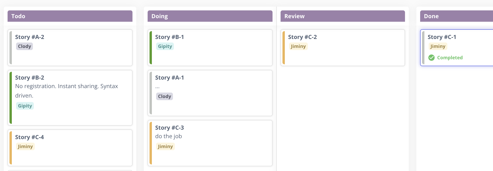

The first time I ran three AI coding agents in parallel, I felt like I'd discovered a productivity cheat code. One agent refactoring the data layer, another writing tests, a third updating frontend views. Three streams of work, one afternoon. Each agent was operating at an expert level, best dev team I ever worked with. I even given them names: Jimini, Clody, and Gipity. :)

Then the merge conflicts started.

Not the usual kind, these were semantic conflicts. Each agent had made locally reasonable decisions that were globally incompatible. The test agent assumed an interface the refactoring agent had changed. The documentation described behavior that no longer existed. Three individually highly competent workers, zero shared understanding.

This problem has a name. We've been solving it for decades in distributed systems: coordination overhead. The more independent actors you have, the more effort goes into keeping them aligned.

What's interesting is how quickly we forgot this lesson when AI agents entered the picture.

Ultimate solution is shared context, and people are working on it. Currently, the workaround that's actually working for me isn't clever prompting or early context orchestration tools. It's older technology: git worktrees. Each agent gets its own worktree, its own branch, its own isolated reality. They can't step on each other because they're not sharing a working directory. The merge becomes explicit, intentional, human-reviewed.

But worktrees only solve the mechanical isolation. The harder problem is upstream: how do you break down work so that parallel streams don't produce semantic conflicts when they converge? A problem we've been solving for decades in software development when optimizing team workflows.

This is where Kanban thinking helps a lot.

Instead of slicing work horizontally by layer (one agent on backend, one on frontend, one on tests), slice it vertically into isolated story streams. Each stream is a thin, complete increment: a feature, a fix, a small capability that can be developed, tested, and merged without depending on work happening in other streams.

The key constraint: stories within a stream are sequential. One agent, one worktree, one stream of work that builds on itself. Parallelism happens across streams, not within them. Agent A works through the authentication story stream while Agent B works through the reporting story stream. They don't need to coordinate because their work doesn't intersect until integration.

This requires discipline in how you decompose work. Not every backlog is structured this way. Most aren't. The natural tendency is to create stories with invisible dependencies, work that looks independent but shares assumptions about database schemas, API contracts, or UI patterns.

The teams getting value from multi-agent setups are the ones who've learned to see these hidden couplings before they become merge conflicts. They design for isolation at the story level, not just the branch level. They accept that some work is inherently sequential because the coordination cost of parallelizing it exceeds the benefit.

Bonus: this discipline has a side effect. When you force yourself to decompose work into truly independent streams, you end up building modular systems. The boundaries you draw for agent isolation become the boundaries in your architecture. Clean interfaces emerge not from upfront design, but from the practical need to keep parallel work from colliding.

You optimize for AI agent productivity and accidentally produce better software structure. Win, win, win.

It's the same lesson we learned with microservices, with distributed databases, with every system that promised scalability through independence: the hard part is never the parallel execution. It's knowing where the seams are.

Git worktrees give you the mechanical isolation. Kanban-style vertical slicing gives you the semantic isolation. And the architecture? It follows.

The agents are ready. The question is whether your backlog is.
