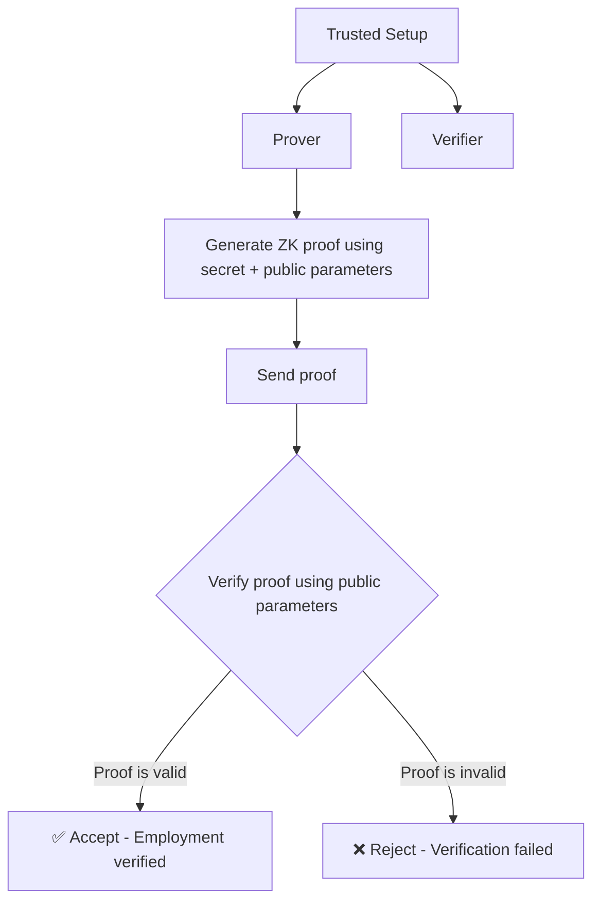

It seems that withing current verification architectures, they impose binary choices: reveal complete information or provide no verification. This led me to explore whether zero-knowledge cryptographic techniques could enable selective disclosure—proving employment status without exposing salary, position details, performance records, or other sensitive information.

To me is interesting how this might fundamentally change verification systems.

## Discovering Design Principles

As I investigated privacy-preserving verification systems, I discovered they need to balance multiple requirements simultaneously:

- **Selective disclosure** - Could we maintain employment detail privacy while enabling status verification?
- **Infrastructure independence** - Might we avoid blockchain dependencies and associated complexity?
- **User sovereignty** - What if users controlled credential storage themselves?
- **Distributed trust** - Could multiple cryptographic keys prevent single points of failure?
- **Standards compliance** - Would supporting decentralized identity protocols enable interoperability?

## Exploring an Architectural Approach

What I found interesting is that multi-key zero-knowledge verification architectures could leverage verifiable credentials with decentralized storage, potentially enabling privacy-preserving verification without blockchain infrastructure dependencies or centralized credential repositories.

### System Components

**User Control Layer**
Users maintain decentralized identifiers (DIDs) with corresponding private keys in secure digital wallets. Verifiable credentials containing employment data exist as encrypted versions or secure references in user-controlled personal data stores.

**Credential Issuance**
Employment verification services issue privacy-preserving verifiable credentials signed with trusted issuance keys. Credentials encode employment status, position, dates, and metadata in encrypted formats supporting selective disclosure.

**Employer Attestation**
Employers utilize dedicated cryptographic keys to attest employment relationships. Signed attestations validate claimant employment status independently from credential issuers, creating multi-party verification.

**Decentralized Storage Infrastructure**
AT Protocol Personal Data Stores host encrypted credentials and metadata under user sovereignty. RESTful APIs enable data retrieval and permissions management while storing secure pointers and cryptographic hashes for verification proof generation.

**Zero-Knowledge Proof Generation**
Cryptographic modules implement zk-SNARKs or Bulletproofs protocols enabling users to prove credential statements without revealing underlying data. Proof generation demonstrates credential control via DID private key possession and valid employment attestation without exposing credential contents.

**Verification Infrastructure**
Verification systems validate zero-knowledge proofs without accessing sensitive data stored in personal data repositories. Cryptographic validation confirms evidence linking DID-based credentials and employer attestations to claimants without requiring credential content access.

## Verification Process Design

A four-phase process separates credential issuance, proof material aggregation, zero-knowledge proof generation, and verification.

### Phase A: Credential Issuance and Storage

The credential issuer creates a verifiable credential with employment details and signs it with their issuance key. The user receives and encrypts the credential, storing it in their personal data store along with secure references and hash commitments.

Independently, the employer generates employment attestation using their verifier key, which gets stored alongside the credential reference.

### Phase B: Proof Material Aggregation

When verification is needed, the user retrieves secure pointers and cryptographic hashes from their personal data store. They locally aggregate the credential issuance evidence through DID-based signatures and the independent employment attestation signed by the verifier key.

This establishes the link between stored credentials and the multi-key requirements for verification.

### Phase C: Zero-Knowledge Proof Generation

The user employs the ZKP module to construct a proof that secretly verifies:

- Ownership of the private key corresponding to their DID
- Existence of a valid verifiable credential via encrypted pointer validation
- Valid employment attestation from the independent verifier

The resulting proof encapsulates all evidence while proving compliance without exposing sensitive data.

### Phase D: Proof Verification

The user submits the generated proof with minimal public parameters—DID public key, verifier's public key, and credential reference commitment. The verification engine validates that the claimant possesses the corresponding private key, the credential pointer matches stored data, and the attestation is correctly signed.

Upon successful verification, employment is authenticated through both credentials without retrieving actual credential data.

### Data Flow and Processes

## Security Principles

### Privacy by Design

The system ensures sensitive employment details remain confidential, referenced only via secure pointers in zero-knowledge proofs. Verifiers learn nothing beyond satisfaction of verification conditions.

### Multi-Key Requirements

Both DID-based key and independent verifier key must produce evidence, minimizing risk from single key compromise and preventing fraudulent verification.

### Decentralized Data Control

Storing credentials on decentralized personal data stores ensures users retain full control over their data, managing access, sharing, and revocation without centralized authorities.

### Revocation Support

The design supports revocation through credential issuer or attestor updates to access-control records. The ZKP module can prove non-revocation or validity periods without exposing additional information.

## Technology Choices

W3C decentralized identifiers and verifiable credentials standards ensure interoperability. AT Protocol personal data stores provide user-controlled storage with fine-grained access policies.

For cryptographic implementation, zk-SNARKs and Bulletproofs frameworks enable succinct proof construction and verification. Standard digital signature algorithms like EdDSA handle both credential issuance and attestation signing.

## System Capabilities

This design creates a privacy-preserving verification system where employment credentials secured through decentralized storage can be proven valid without exposing sensitive data.

The key capabilities include:

- Decentralized storage and data control ensuring secure, user-controlled credential access
- Robust two-factor evidence requiring both claimant's DID-based key and independent verifier's key
- Zero-knowledge proof techniques enabling employment verification while preserving privacy

The result is a secure credential verification system relying on cryptographic attestations and decentralized storage management while removing blockchain dependencies.

## Key Insights from This Design

This system demonstrates that privacy and verification aren't mutually exclusive when proper cryptographic techniques are applied. Zero-knowledge proofs enable selective disclosure that solves real-world privacy problems without sacrificing verification integrity.

The multi-key approach provides security benefits beyond single-key systems while decentralized storage ensures users maintain control over their sensitive information. Avoiding blockchain dependencies makes the system more practical for real-world deployment while maintaining strong security properties.
