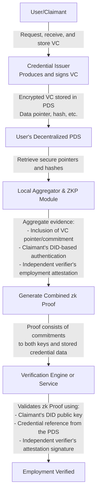

## Musings on Zero-Knowledge Proofs

Below is a mussing about the design for a multi-key zero-knowledge (zk) verification system that leverages decentralized verifiable credentials stored on decentralized storage (such as an AT Protocol Personal Data Store, PDS) without any references to blockchain. This design focuses on proving, for example, employment by requiring both a decentralized identifier (DID)-based private key and an independent verifier key, while storing verifiable credentials (VCs) in a decentralized storage network.

---

## Overview

The system enables a user (claimant) to demonstrate possession of employment credentials without revealing underlying sensitive details. The proof generation demands that both the claimant's DID-associated private key and an independent verifier's key (used to attest employment) are used to create a combined zero-knowledge proof. Verifiable credentials are stored within a decentralized data store (like an AT Protocol PDS), giving users full control over their data while ensuring a privacy-preserving verification process.

---

### Architectural Components

- **User (Claimant):**
  - Possesses a DID and its corresponding private key in a secure digital wallet.
  - Receives verifiable credentials (VCs) that contain employment-related data, issued by a credential issuer.
  - Stores the encrypted VCs or references (e.g., secure pointers, hashes) to these credentials in a Personal Data Store (PDS) on a decentralized storage platform.
  - Initiates the process to generate a zk proof using locally stored pointers/references and the necessary keys.

- **Credential Issuer:**
  - Issues employment verifiable credentials (VCs) in a privacy-preserving format by signing them using its trusted issuance key.
  - The credentials encode employment status, position, dates, and other relevant metadata, then are provided to the claimant in an encrypted format.

- **Independent Verifier (Employer/Attestor):**
  - Uses an independent verifier key to attest the employment relationship.
  - Issues a signed attestation or confirmation that the claimant's employment is valid.
  - Provides this attestation either directly or in a format that can be stored alongside the VC reference.

- **Decentralized Storage (AT Protocol PDS):**
  - Hosts encrypted verifiable credentials and related metadata, controlled and maintained by the user.
  - Provides interfaces (e.g., RESTful APIs) for data retrieval, update, and permissions management.
  - Stores secure pointers or hashes of the credentials to be later included in the verification proofs.

- **Zero-Knowledge Proof (ZKP) Module:**
  - Implements zero-knowledge proof protocols (e.g., zk-SNARKs, Bulletproofs) that allow the user to prove statements about their credentials without revealing any underlying data.
  - Generates the final proof that demonstrates the claimant's control over the VC via the DID private key and the existence of a valid employment attestation from the independent verifier.

- **Verification Engine:**
  - Serves as the system that verifies the zk proof without accessing or retrieving sensitive data stored in the PDS.
  - Checks that the zk proof includes valid cryptographic evidence (such as commitments and signatures) that both the DID-based credential and the independent verifier attestation are linked to the claimant.

---

## Data Flow and Processes

### A. Credential Issuance and PDS Storage

1. The credential issuer creates a verifiable credential encapsulating employment details and signs it with its issuance key.
2. The user receives the credential and subsequently encrypts it.
3. The encrypted credential (or its secure reference and a hash commitment) is then stored in the user's PDS.
4. Independently, the employer or attestor generates an attestation of employment using its verifier key.
5. The employment attestation is provided to the user—either stored directly in the PDS or kept as a separate signed artifact.

### B. Aggregation of Proof Material

1. The user retrieves the secure pointers and metadata (such as cryptographic hashes) from the PDS that reference the encrypted VC.
2. The user locally aggregates:
   - The credential issuance evidence (via DID-based signature tied to the stored VC pointer/commitment).
   - The independent employment attestation (signed using the verifier key).
3. The aggregated data establishes a link between the VC stored on decentralized storage and the required multi-key presence required for verification.

### C. Zero-Knowledge Proof Generation

1. The user employs the ZKP Module to construct a proof that secretly verifies:
   - Ownership of the private key corresponding to their DID by proving knowledge of it (without revealing the key itself).
   - A valid verifiable credential exists by validating the encrypted VC pointer/hash from the PDS.
   - A valid employment attestation exists as provided by the independent verifier, whose signature is also verified within the circuit.
2. The resulting zk proof encapsulates all the above evidence, proving compliance with the verification conditions without exposing sensitive data.

### D. Proof Verification

1. The user submits the generated zk proof along with a minimal set of public parameters (e.g., the claimant's DID public key, the verifier's public key, and the credential reference commitment) to the Verification Engine.
2. The Verification Engine validates that:
   - The claimant indeed possesses the private key corresponding to the provided DID public key.
   - The credential pointer or hash provided in the proof matches what is stored securely in the PDS.
   - The independent attestation is valid and correctly signed by the verifier's key.
3. Upon successful verification, the engine confirms that the claimant's employment is authenticated through both credentials, without retrieving or revealing the actual credential data from the PDS.

---

### Security and Privacy Considerations

- **Privacy by Design:**
  - The system ensures that actual sensitive data (employment details) remains confidential and is only referenced via secure pointers/hashes in the zk proofs.
  - Zero-knowledge proofs guarantee that verifiers learn nothing beyond the fact that the given conditions are satisfied.

- **Multi-Key Requirement:**
  - The solution mandates that both the DID-based key and the independent verifier key produce evidence, minimizing risk and ensuring that no single key compromise enables fraudulent verification.

- **Decentralized Data Control:**
  - Storing verifiable credentials on a decentralized PDS ensures that users retain full control over their data and can manage access, sharing, and revocation without reliance on a centralized authority.

- **Revocation and Updates:**
  - The design can support revocation by having the credential issuer or attestor update access-control records in the PDS.
  - The ZKP Module may include mechanisms for proving non-revocation or validity periods without exposing more information.

---

### Technologies and Protocols

- **Decentralized Identifiers (DIDs) and Verifiable Credentials:**
  - Standards such as those defined by W3C to ensure interoperability and secure management of credentials.

- **Decentralized Storage (AT Protocol PDS):**
  - A storage platform that allows users to store their encrypted verifiable credentials and maintain fine-grained control over access policies.

- **Zero-Knowledge Proof Frameworks:**
  - Cryptographic libraries and tools (such as those based on zk-SNARKs or Bulletproofs) to facilitate the construction and verification of succinct proofs.

- **Cryptographic Signature Schemes:**
  - Standard digital signature algorithms (e.g., EdDSA, RSA, or ECDSA variants) that are used both by the credential issuer and the independent verifier for signing attestations.

---

### High-Level Block Diagram

## Summary

This design describes a multi-key verification system where employment credentials—secured through decentralized storage (e.g., an AT Protocol PDS)—are proven valid without exposing sensitive data. The key features include:

- Decentralized storage and data control, ensuring that credentials are securely stored and accessible only as required.
- A robust two-factor evidence approach requiring both the claimant's DID-based key and an independent verifier's key to generate a zero-knowledge proof.
- Zero-knowledge proof techniques that allow verification of the employment claim while preserving privacy.

The result is a privacy-preserving, secure system for credential verification that relies on cryptographic attestations and decentralized storage management while removing any reliance on blockchain technology.
